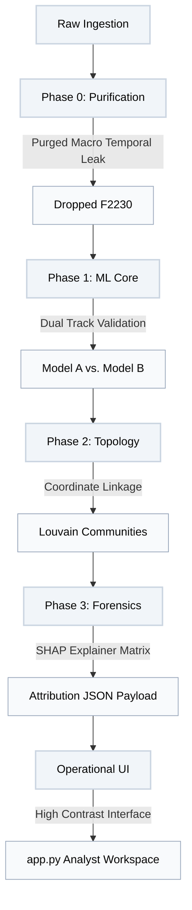

# RegShield AI: High Imbalance Financial Fraud Detection and Network Topology Pipeline

An explainable machine learning and network analytics engine optimized for high imbalance financial fraud detection. Built defensively against data leakage to isolate money mule signatures using dual track classification, post hoc game theoretic feature attributions, and spatial temporal entity linkage graph networks.

---

## 1. Project Architecture Overview



The system is organized into a modular pipeline structure designed to transition raw financial accounting blocks securely into audited, regulatory ready intelligence profiles.

* **src/config.py:** Holds global project constants, directory path anchors, mapping variables, and structural seeds.
* **src/phase0_pipeline.py:** Executes data purification, handles missingness transformations, and remediates tracking leaks.
* **src/phase1_model.py:** Compiles the dual track machine learning core, managing dynamic fold weight scaling and threshold tuning.
* **src/phase2_graph.py:** Constructs the spatial temporal node coordinate network to segment coordinated laundering syndicates.
* **src/phase3_explain.py:** Computes post hoc Shapley value arrays to compile explicit case file payloads.
* **src/app.py:** Hosts the high contrast, professional analyst workflow interface.

---

## 2. Phase 0: Data Purification and Leakage Remediation

The operational data framework ingests a complex ledger structure characterized by extreme target sparsity and heavy dimension dimensionality.

### Structural Data Realities

* **Scale and Asymmetry:** The target profile encompasses 9,082 account profiles mapping across 3,924 raw data dimensions. The target vector operates under an extreme 111:1 imbalanced class ratio, containing 9,001 compliant accounts and exactly 81 verified fraud targets.
* **Sparsity Mapping:** A total of 1,260 feature columns exhibit heavy missingness exceeding a 30% null threshold, while 63 columns are found to be completely empty.

### Optimization Mechanics

* **Missingness Transformation:** Instead of applying traditional statistical imputation mechanics like replacing missing blocks with columns means or medians, the pipeline converts sparse blocks into binary indicator vectors via `_wasnull` tags. This treats the absence of corporate tracking attributes as an active behavioral feature marker.
* **Outlier Compression:** 10 highly volatile monetary transaction volume fields (including fields `F3806`, `F3807`, and `F1813`) are compressed using a mathematical $\log(x + 1)$ transform to smooth out extreme distribution tails.
* **Leak Remediation Protocol:** Initial testing exposed an artificial macro temporal leak caused by feature `F2230` (the transaction month year indicator), which had compressed all active fraud instances into narrow autumn slices. The script enforces a strict purge of this column to prevent the downstream network from simply memorizing dates instead of mapping real behavioral indicators.

---

## 3. Phase 1: Machine Learning Core and Validation Engineering

To ensure long term modeling resilience on extreme class boundaries, the framework avoids basic validation strategies in favor of a dual track evaluation architecture.

### Modeling Paths

* **Model A (Complete Universe):** Trains across the entire engineered feature matrix, including the bank's internal indicator flag `F3912`.
* **Model B (The Ablation Track):** Completely strips away the corporate indicator flag `F3912`. This track forces the ensemble to classify targets using purely behavioral indicators and missingness profiles, providing a defensive alternative if primary corporate flags fail.

### Validation Training Loop

* **Multi Seed Stratification:** To stabilize model variance on a tiny minority class pool (81 positive vectors), the pipeline executes a total of 10 validation folds across separate, localized multi seed configurations (`seeds = [42, 52]`).
* **Dynamic Minority Boosting:** To prevent structural data leakage, the code evaluates training slice imbalance boundaries dynamically within each fold split. This updates XGBoost's internal `scale_pos_weight` parameter on the fly based on the localized training ratio rather than a fixed global average.
* **Precision Recall Threshold Tuning:** Standard binary tree cutoffs default to 0.5. Because the target class is exceptionally rare, the validation loop uses a custom threshold optimizer that maps the full Precision Recall curve to find the exact probability cutoff that maximizes the $F_1$-score.

### Verified Tracking Metrics

* **Model A Profile:** Achieved a Mean PR-AUC of 0.9713 and an optimized $F_1$-score of 0.9754 at a tight threshold of 0.9654.
* **Model B Profile:** Achieved a Mean PR-AUC of 0.9288 and an optimized $F_1$-score of 0.9099 at an operational threshold of 0.4204.

---

## 4. Phase 2: Spatial-Temporal Network Topology

When mapping coordinated financial laundering syndicates, transaction routing histories (sender to receiver maps) are often missing or delayed. The pipeline overcomes this data barrier by building an advanced spatial temporal coordinate network.

### Coordinate Intersection Linkage

Instead of routing flows, the graph core intersects shared operational execution time windows (`F3888`) with the exact localized transaction geography codes (`F3890`). It instantiates an undirected network of 9,082 nodes using `networkx`, drawing structural edges between accounts only when they operate in the exact same physical region at the exact same point in time.

### Heuristic Modularity Segmentation

The global connectivity matrix is passed directly through the Louvain Community Detection Algorithm to segment closely coupled account nodes into distinct cluster partitions.

The graph core extracts and serializes explicit localized density features for every single target:

* **Network Cluster ID:** Maps the localized coordinate community structure.
* **Peer Connection Degree:** Tracks the exact count of other accounts operating in lockstep with the subject.
* **Local Clustering Coefficient:** Measures neighborhood density. A coefficient of exactly 1.0 flags a closed clique of synchronized accounts executing co located transactions simultaneously.

---

## 5. Phase 3: Post-Hoc Game-Theoretic Forensics

To comply with international banking regulations and pass stringent internal audits, the ablated Model B track must be transitioned from a complex ensemble into a transparent forensic asset.

### Shapley Value Attribution

The pipeline instantiates a post hoc mathematical explanation engine powered by a `shap.TreeExplainer` tracking across our ablated model states. This maps additive feature importance contributions back to individual account ledgers.

### Unified Target Profiles

The engine parses out of fold probability vectors to select the top 15 highest risk targets and combines their statistical metrics with the topological network indicators from Phase 2. This formats a structured forensic json asset (`investigator_case_profiles.json`) tracking precise case drivers:

```json
{
  "9028": {
    "investigator_rank": 1,
    "anomaly_probability_pct": 99.98,
    "ground_truth_mule_status": 1,
    "network_context": {
      "cluster_id": 2710,
      "peer_connection_degree": 0,
      "neighborhood_density_coefficient": 0.0
    },
    "top_behavioral_triggers": [
      {
        "feature": "F3898",
        "value": 0.0,
        "shap_impact": 1.3056,
        "influence": "elevated"
      }
    ]
  }
}
```

The forensics show that even when stripped of corporate markers, the engine isolates tight data constraints on features `F3898`, `F2489`, and `F3914` to catch mule signatures with near perfect certainty.

---

## 6. Operational Interface Layer (`src/app.py`)

The presentation layer compiles all backend assets into a high contrast, professional analyst console built entirely in Streamlit.

### Interface Enhancements

* **Interactive Analyst Flow:** The console deploys a left aligned sidebar controller picker. Selecting an active target index immediately splits the center panel into a layout displaying the target's spatial topological network data right next to their post hoc SHAP attribution table, finalized by an automated regulatory compliance directive block.

---

## 7. Execution and Deployment Sequence

Ensure your local Python 3.12 environment is initialized, then run the full pipeline step by step:

### Step 1: Install Dependencies

```bash
pip install pandas numpy==1.26.4 pyarrow xgboost scikit-learn networkx python-louvain shap streamlit
```

### Step 2: Run Backend Pipeline In Order

```bash
python src/phase0_pipeline.py
python src/phase1_model.py
python src/phase2_graph.py
python src/phase3_explain.py
```

### Step 3: Boot the Operational Analyst Dashboard

```bash
streamlit run src/app.py
```